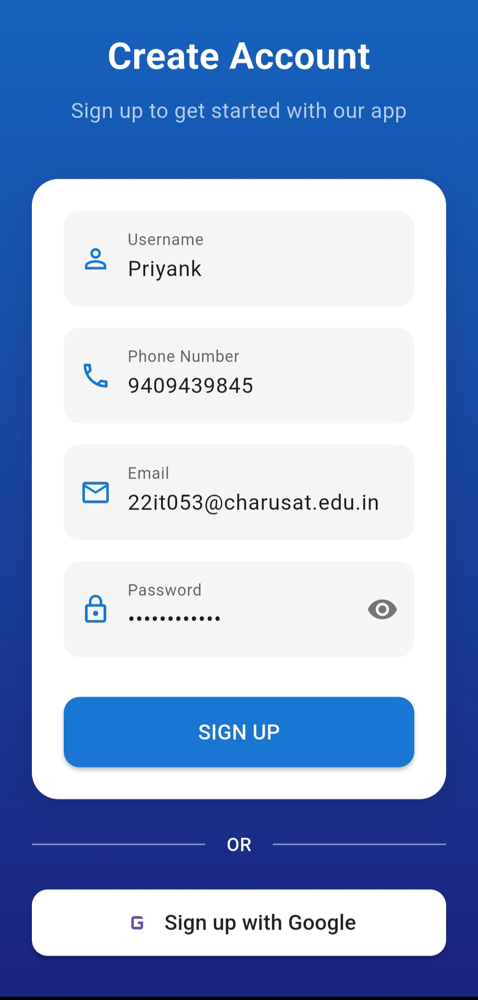

# CancerVision
CancerVision is a comprehensive application designed to assist users in understanding and diagnosing various types of cancer through advanced AI models. The app provides features such as image analysis, health tips, and a chatbot for cancer-related queries.

## Introduction

CancerVision leverages state-of-the-art deep learning models and natural language processing to provide users with insights and diagnoses related to different types of cancer. It supports image analysis for histopathology images, offers health tips, and includes a chatbot powered by a trained LLaMA model for answering cancer-related questions.

## Features:
### User Authentication
- **Signup and Login:** Users must create an account and log in to access the app's features.

  
  

### Dashboard
- **Overview:** Displays total scanned images and the date of the last scan.
- **Cancer Information:** Provides brief descriptions of various cancer types, such as lung, breast, and colon cancer.

### Image Analysis
- **Upload Image:** Users can upload histopathology images for analysis.
- **Analyze Image:** Image is uploaded to Firebase, triggering an API call to classify the image into cancer types like carcinoma and adenocarcinoma.
- **Prediction Results:** Presents the predicted class, confidence score, and individual predictions from each of the three pre-trained models.

### Records
- **View Records:** Users can access previously predicted image records, including timestamps, images, prediction classes, and confidence scores.

### Profile Management
- **Edit Profile:** Users can modify personal information.
- **Delete Account:** Users can permanently delete their account.

### Health Tips
- **Daily Tips:** Provides users with health tips related to cancer prevention and care.

### Chatbot
- **Cancer Queries:** Users can ask questions and receive responses from a trained LLaMA model.
- **Delete Chat History:** Users can clear their chat history.

### Data Storage
- **SQLite Database:** Utilized to maintain user state and data persistence.
- **Firebase:** Used to authenticate user and store all the information and images to retrival.
